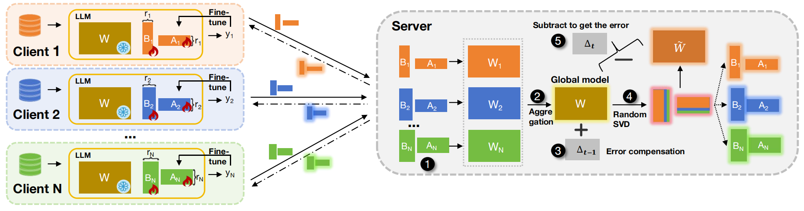

# Federated Fine-tuning on Heterogeneous LoRAs with Error-Compensated Aggregation


## Introduction
We propose ECLoRA, a novel method for federated fine-tuning with heterogeneous LoRA settings across clients. ECLoRA employs randomized SVD (RSVD) to dramatically reduce aggregation overhead, while introducing an error
compensation (EC) mechanism that incorporates the decomposition error from previous rounds to improve aggregation precision.

## Run
```
CUDA_VISIBLE_DEVICES=0 python main.py \
    --dataset mrpc \
    --aggregation eclora \
    --model_name roberta-large \
    --seed 0 \
    --logging \
    --output_name default
```
This is a sample run command, you can change the hyperparameters yourself.

## Citation
```
@ARTICLE{ning2025eclora,
  author={Ning, Wanyi and Wang, Jingyu and Qi, Qi and Sun, Haifeng and Cheng, Daixuan and Liu, Cong and Zhang, Lei and Zhuang, Zirui and Liao, Jianxin},
  journal={IEEE Transactions on Neural Networks and Learning Systems}, 
  title={Federated Fine-Tuning on Heterogeneous LoRAs With Error-Compensated Aggregation}, 
  year={2025},
  pages={1-15},
  doi={10.1109/TNNLS.2025.3586545}}
```
